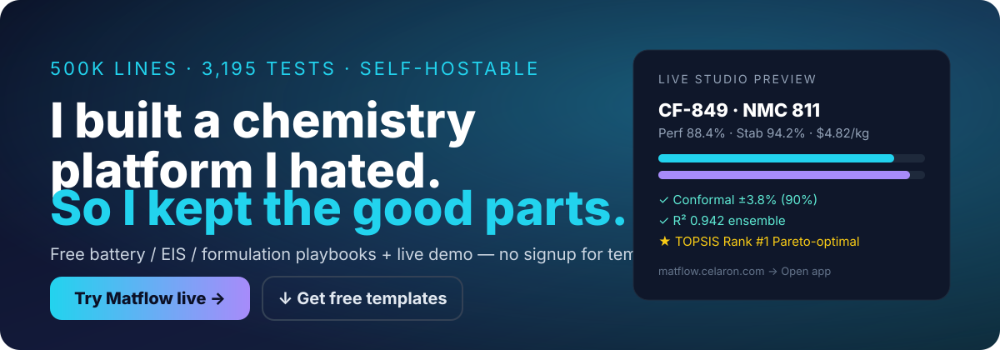
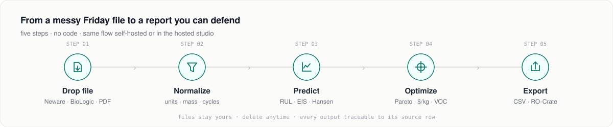
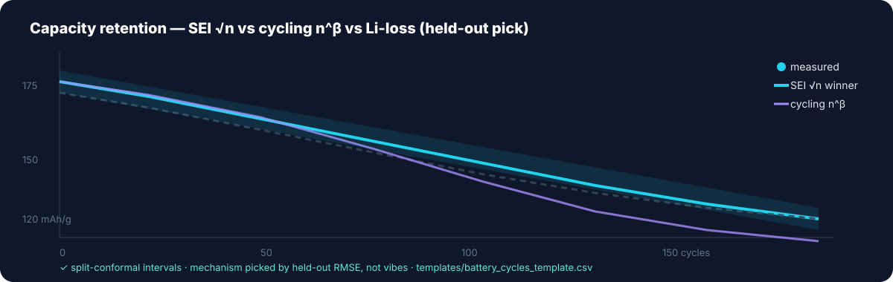
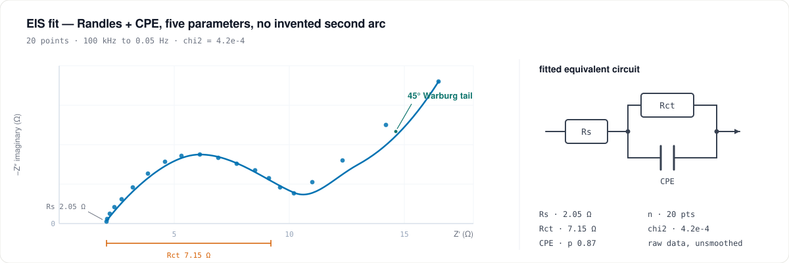
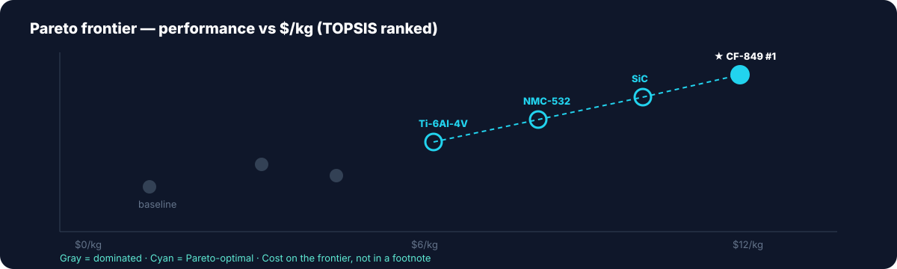



**This repo has almost no code. That's the point.**

Free survival kit for battery Excel hell, EIS spectra, and formulation spreadsheets — plus the live monster I built to escape it.

**Try Matflow live: https://matflow.celaron.com** — Data workspace → “use demo dataset”

---

| Drop | Normalize | Predict | Optimize | Export |
|---|---|---|---|---|
| Neware, BioLogic, Arbin, Excel, PDF | units, mass, cycles, 11 QA checks | RUL, EIS, Hansen ± intervals | Pareto + $/kg + VOC | CSV, RO-Crate, dossier |

## The pain (pick your poison)

<table>
<tr>
<td width="33%" valign="top">

### Battery Friday panic
3 cyclers, 3 formats, missing mass, PI wants a plot.
Your two curves are off by 22% because mass was electrode-total in one, active in the other.

**Free fix ↓**
`templates/battery_cycles_template.csv`

</td>
<td width="33%" valign="top">

### EIS semicircle of doom
You have a Nyquist plot and need Rs, Rct, Warburg — now.
Fit 7 elements and it's overfit. Fit 2 and your reviewer laughs.

**Free fix ↓**
`templates/eis_sample.csv`

</td>
<td width="33%" valign="top">

### Formulation DOE hell
120 solvents, 5 ingredients, sum must = 1.0.
Random points waste runs. PI says “just DOE it”.

**Free fix ↓**
`templates/formulation_runs_template.csv`

</td>
</tr>
</table>

### Evidence first — no fake science
Every number in Matflow carries one. Synthetic is always `DEMO`, charges $0, never presented as real. Audit log is hash-chained. Export via RO-Crate + OPTIMADE so you can leave anytime.

---

## 1. Battery cycle-life that survives review

**Messy in → clean out:**
- `Neware_45C_cell3.xlsx`: `Cap(mAh)`, merged headers, rest steps counted as cycles 12, 13, 14
- `Biologic_VMP3.mpt`: 40k rows, `I/mA` vs `Ewe/V`, no mass column
- **Out:** one table — cycle, Q_charge, Q_discharge, CE, V_mean, T, mass_active_g, source_file, excluded_reason + retention plot with mechanism + interval

**Free in this repo:**
- `templates/battery_cycles_template.csv` — 20-row clean example that actually imports
- `templates/cycler_qa_checklist.md` — 11-point QA (mass, units, cycle reconstruction)
- `cheatsheets/battery-excel-cleaning-guide.md` — Neware/BioLogic/Arbin fix order
- `prompts/llm-prompts-for-battery-reports.md` — weekly report prompts

**1-click in Matflow:** upload → auto-normalize → RUL with split-conformal intervals → mechanism analyzer (SEI √n vs cycling n^β vs Li-loss, picked by held-out RMSE) → reproducible export.
Live version: https://matflow.celaron.com

Common searches that land here

`battery cycle life prediction excel, neware btsda capacity csv, biologics mpt to csv, battery RUL python, cellpy alternative hosted`

---

## 2. EIS Nyquist → Rs / Rct / Warburg without $2k software

**Fit order that works:**
1. High-freq intercept → **Rs** (1–5 Ω for liquid cells)
2. Main semicircle diameter → **Rct**
3. 45° tail → **Warburg**. Vertical tail → capacitive, drop W.
4. >4 elements to look pretty = overfit.

**Free in this repo:**
- `templates/eis_sample.csv` — clean Z' / -Z'' that won't crash fitters
- `cheatsheets/eis-fitting-guide.md` — Randles vs SEI vs Warburg picker + red flags

**1-click in Matflow:** measured spectrum → Randles/SEI/Warburg params + defendable plots.
Live version: https://matflow.celaron.com

---

## 3. Formulations: Hansen + D-optimal on one page

**Hansen in one line:** Ra² = 4(dD₁-dD₂)² + (dP₁-dP₂)² + (dH₁-dH₂)². RED = Ra/R₀. RED < 1 = good.

**D-optimal in one paragraph:** constraints A 0.5–0.7, B 0.2–0.4, C 0.1–0.2. Random wastes runs. Coordinate-exchange picks 8 + 2 center repeats for Scheffé quadratic, reports D-efficiency.

**Free in this repo:**
- `templates/formulation_runs_template.csv` — fractions sum to 1.00 check included
- `cheatsheets/hansen-solubility-guide.md` — RidgeCV/RDKit/LOO-MAE explained like you're 5
- `prompts/llm-prompts-for-formulations.md` — run-sheet + next-batch picker

**1-click in Matflow:** fitted Hansen with intervals + applicability flag + D-optimal design.
Live version: https://matflow.celaron.com

---

## All free loot (MIT — steal it)

| File | What | Open in |
|---|---|---|
| `templates/battery_cycles_template.csv` | 20-row clean cycles | Excel / Sheets / Python |
| `templates/eis_sample.csv` | Clean Nyquist spectrum | Any fitter |
| `templates/formulation_runs_template.csv` | Mixture + constraints | Any DOE tool |
| `templates/cycler_qa_checklist.md` | 11-point import QA | 2 min read |
| `cheatsheets/battery-excel-cleaning-guide.md` | Cross-vendor cleaning | 5 min |
| `cheatsheets/eis-fitting-guide.md` | Circuit picker | 5 min |
| `cheatsheets/hansen-solubility-guide.md` | Hansen plain-English | 5 min |
| `prompts/llm-prompts-for-battery-reports.md` | Report prompts | Copy-paste |
| `prompts/llm-prompts-for-formulations.md` | DOE prompts | Copy-paste |
| `examples/before-after.md` | Messy → governed | See the bar |

No `pip install`. No Docker. Just download.

---

## Honest comparison

| Tool | Good at | Pain |
|---|---|---|
| **cellpy** (free, MIT) | Reads many cycler formats, great lib | You code everything, no hosted review/export |
| **BioLogic EC-Lab / Neware BTSDA** | Native for their box | Single-vendor, cross-brand batch = pain |
| **JMP / Citrine / MaterialsZone** | Real stats, real platform | Price, procurement, overkill for 1 lab |
| **Matflow → https://matflow.celaron.com** | Cross-vendor ingest + review + uncertainty + export you own, self-hostable | Beta. Student-built. No enterprise support. DEMO always labelled. |

If native software does your job, stay there. If you stitch 3 exports every Friday, try the demo dataset.

---

## Pricing (pays the server, not a yacht)

Starter **$99** / Pro **$349** / Enterprise from **$999**/mo. Credit packs **$8–$110** for real compute. Free tier: 5 datasets, 2 campaigns, 10 copilot msgs/mo, watermarked dossiers. Academic `.edu/.ac` free.

This repo stays free forever. Take the templates even if you never click Matflow.

---

## Get 3 months Pro free (5 labs)

1. Try demo at https://matflow.celaron.com
2. Run 1 real file (you own rights)
3. Post before/after + what broke

Open an issue: `LAB-TRY: <your instrument, rows, desired output>`. No sales call. Async only — during exams I reply slow, jobs queue, data stays.

---

### Built for fun with free LLM credits + a Contabo box.
### I'm GenAI/LLMs, not materials — that's why ingest → review → export is boring and works.

If a template saved you 30 minutes, a star is the entire marketing budget.

`battery · EIS · Hansen · DOE · Pareto · RO-Crate · OPTIMADE · PyBaMM · self-hosted`

